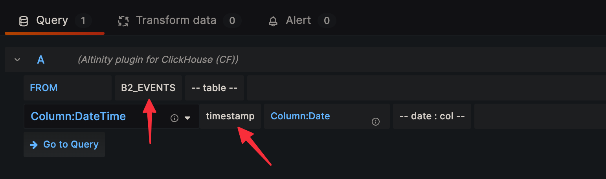
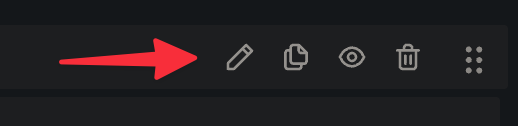
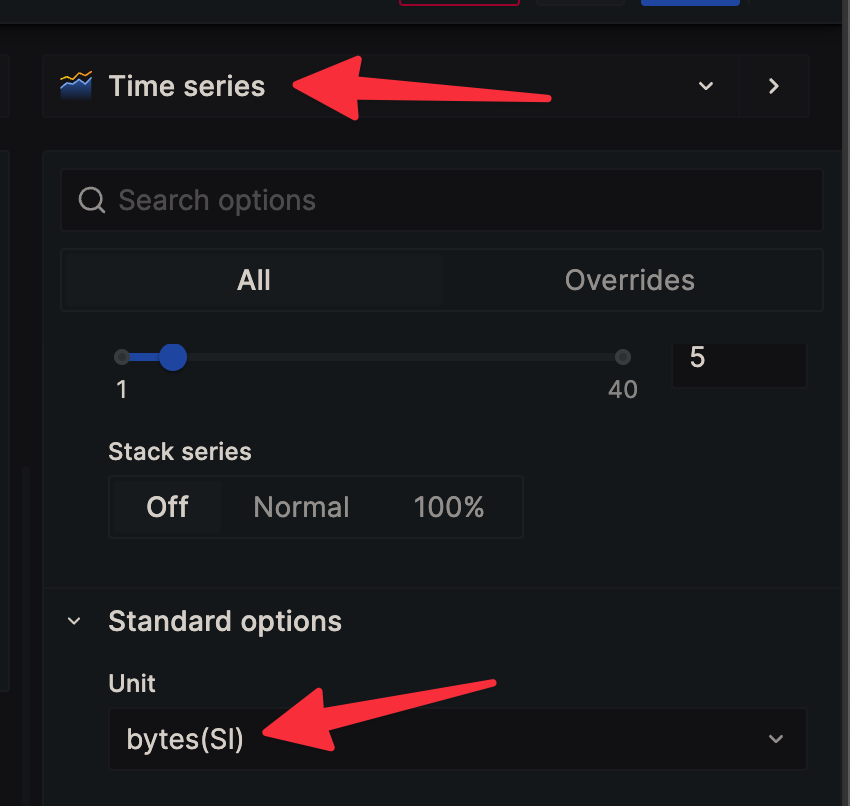
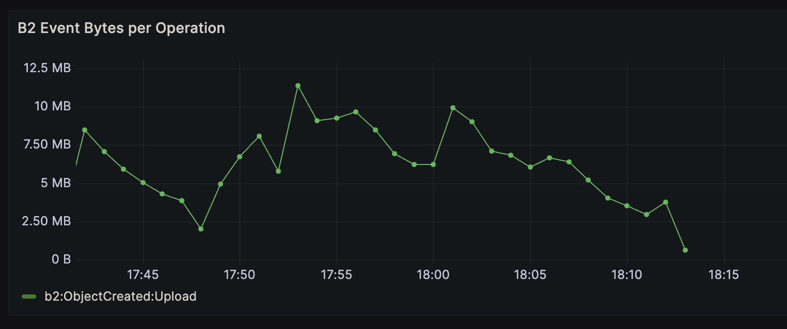

# b2-workers-grafana

Graph B2 IO using B2 Event Notifications, Workers Analytics Engine, and Grafana

## Prerequisites

- [Node.js 18+](https://nodejs.org/en/download/package-manager)
- [pnpm](https://pnpm.io/installation)
- [Cloudflare account](https://dash.cloudflare.com/sign-up)
- [Backblaze B2 account](https://www.backblaze.com/b2/sign-up/)
- [Grafana account](https://grafana.com/) (or a self-hosted instance.)

## Setup

### Install dependencies

```shell
pnpm install
```


### Deploy to Cloudflare Workers

Run from within `packages/b2-notif-worker`:

```shell
pnpm wrangler deploy
```

This will give you a URL to the deployed worker. For example:
https://b2-notif-worker.jahands.workers.dev

### Configure B2 Event Notifications

1. Login to [Backblaze](https://backblaze.com) and navigate to B2 buckets.
2. Click on Event Notifications for the bucket you want to monitor.
3. Click **+ Add New Rule**
4. Add the following rule:
  - Name: workers-b2-grafana
  - Event Types: Object Created, Object Deleted
  - Click **Generate Secret** and copy the secret.
  - Webhook Target URL: `https://b2-notif-worker.jahands.workers.dev/notify` (replacing with the hostname from the previous step.)
5. Click **Save**

### Upload signing secret to the Worker

Run from within `packages/b2-notif-worker`:

```shell
pnpm wrangler secret put B2_SIGNING_SECRET
```

When prompted, enter the signing secret from the previous step and press enter.

### Query from Grafana

#### 1. Follow the instructions [here](https://developers.cloudflare.com/analytics/analytics-engine/grafana/) to set up Grafana to query Cloudflare Analytics Engine.
#### 2. Create a new dashboard and add a new panel.
#### 3. Select Altinity Plugin for Clickhouse as the data source.
#### 4. In the query editor, set the following settings:
  
  If you don't see these options, you may need to click the editor toggle button on the top write of the query editor:
  
#### 5. In the query editor, enter the following query:
  ```sql
  SELECT
    $timeSeries as t,
    SUM(double1 * _sample_interval) as TotalBytes,
    blob4 as EventType
  FROM B2_EVENTS
  WHERE $timeFilter
  GROUP BY t, EventType
  ORDER BY t
6. On the right side of the window in the panel settings, ensure **Time Series** is selected at the top, and set the **Unit** to **Bytes (SI)**:
  ```
  

## Demo

If everything worked, you should see something like this in Grafana:



## Debugging

If you have any issues, you can tail logs for the Worker by running the following command within `packages/b2-notif-worker`:

```shell
pnpm wrangler tail
```
